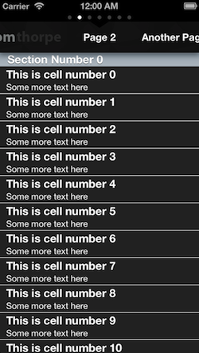
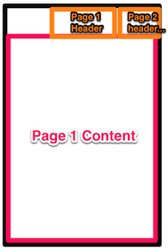

UIScrollSlidingPages
=========================

An example of an app using this control as it's main UI is the Tom Thorpe Photography app, available on the [App Store](https://itunes.apple.com/us/app/tom-thorpe-photography/id614901245?mt=8)

Example Screenshots
---


This is a **WORK IN PROGRESS** control that will eventually allow you to add multiple view controllers and have them scroll horizontally, each with a smaller header view that scrolls in proportion as the content scrolls. Similar in style to the Groupon app.

You should not use this control yet unless you accept the fact that it may change dramatically.


    


Installation
---
* Include the files in the  `Source` directory somewhere in your project using the Add Files option of XCode, Submodules, or however you normally include files from external repositories.
* Add `#import "TTUIScrollViewSlidingPages.h"` in your source wherever you plan to use this control.
                                                                                                                                                                                                                                                        
Usage
---
###What is UIScrollSlidingPages?
UIScrollSlidingPages is the project name for the `TTScrollSlidingPagesController` UIViewController. The control is a horizontal paged scroller complete with a header area, the standard "page dots" showing the current page, and an UI effect as you scroll between pages.



As mentioned above, the control contains two main "areas" - the content area and the header area - and is made up of "pages". The content area takes up the full width of the control and is paged, meaning the user sees one page at a time, whereas the pages in the header area do not take up the full width, allowing the user to see the next and previous page headers. The user may scroll horizontally between the pages by dragging left to right anywhere on the control, or tapping one of the pages in the header area. The two areas will stay in-sync to mean that the header of the current page is always in the middle of the header area.


### Instantiating the View Controller.

To use the control, create an instance of `TTScrollSlidingPagesController`. This is just a subclass of UIViewController, once you have instantiated it you can use the view property to add to your view like you would with any other UIViewController (normally by adding the `view` property of your instance as a subview to your current view, navigation controller, tab bar etc.). 

There is one main distinction, once you have instantiated `TTScrollSlidingPagesController` you should set the `dataSource` property, in a very similar way you would with a `UITableViewController`. The datasource should be set to an object that conforms to the `TTSlidingPagesDataSource` protocol. See the section below for details on implementing `TTSlidingPagesDataSource`.


For example, to instantiate `TTScrollSlidingPagesController` and add it to the current view from another view controller, do the following:

```  objc
    TTScrollSlidingPagesController slider = [[TTScrollSlidingPagesController alloc] init];
    slider.dataSource = self; /*the current view controller (self) conforms to the TTSlidingPagesDataSource protocol)*/
    slider.view.frame = self.view.frame; //I'm setting up the view to be fullscreen in the current view
    [scrollPagerView addSubview:slider.view];
    [self addChildViewController:slider]; //this makes sure the instance isn't released from memory :-)
```

###Implementing TTSlidingPagesDataSource
* `-numberOfPagesForSlidingPagesViewController:` This returns an integer which indicates how many pages the control has. The below two methods will then each be called this many times, one for each page.
* `-pageForSlidingPagesViewController:atIndex:` This returns a `TTSlidingPage` instance containing the view or viewController for the view you want to be in the content area for the page. See below for a description of the `TTSlidingPage` class
* `titleForSlidingPagesViewController:(TTScrollSlidingPagesController*)source atIndex:(int)index;` This returns a `TTSlidingPageTitle` instance that contains the title text or image of the header for the page. See below for a description of the `TTSlidingPageTitle` class.


#####TTSlidingPage
This is returned by the `TTSlidingPagesDataSource`. It represents the page content view for a a given page that will go in the content area. You can instantiate it either with a UIViewController has the content using `-initWithContentViewController:(UIViewController *)contentViewController` (recommended as it means the view stack will be correctly maintained), or using `initWithContentView:(UIView *)contentView;` if you only have a UIView. 

#####TTSlidingPageTitle
This is returned by the `TTSlidingPagesDataSource`. It represents the header for a given page that will go in the header area. It can either be an image or text. To instantiate it with an image use `initWithHeaderImage:(UIImage*)headerImage` or instantiate it with plain text use `initWithHeaderText:(NSString*)headerText`

####Full Example of implementing TTSlidingPagesDataSource

For example, to implement the TTSlidingPagesDataSource to your class, add "<TTSlidingPagesDataSource>" after your class name in the .h header file, for example:

``` objc
@interface TTViewController : UIViewController<TTSlidingPagesDataSource>{
}
```


Then implement the three datasource methods methods:

``` objc
-(int)numberOfPagesForSlidingPagesViewController:(TTScrollSlidingPagesController *)source{
    return 5; //5 pages. The below two methods will each now get called 5 times, one for 
}

-(TTSlidingPage *)pageForSlidingPagesViewController:(TTScrollSlidingPagesController*)source atIndex:(int)index{
    UIViewController *viewController = [[UIViewController alloc] init];    
    return [[TTSlidingPage alloc] initWithContentViewController:viewController]; //in reality, you would return an actual view controller for the page (given by index) that you want, rather than just a blank UIViewController. In the demo app in the repository, I return instances of my own UIViewController subclass; TabOneViewController and TabTwoViewController. You can also just use a UIView but this wont preserve the full view hierarchy unless you handle it yourself.
}

-(TTSlidingPageTitle *)titleForSlidingPagesViewController:(TTScrollSlidingPagesController *)source atIndex:(int)index{
    TTSlidingPageTitle *title;
    if (index == 0){ //for the first page, have an image, for all other pages use text
        //use a image as the header for the first page
        title= [[TTSlidingPageTitle alloc] initWithHeaderImage:[UIImage imageNamed:@"randomImage.png"]];
    } else {
        //all other pages just use a simple text header
        title = [[TTSlidingPageTitle alloc] initWithHeaderText:@"A page"]; //in reality you would have the correct header text for your page number given by "index"       
    }
    return title;
}

``` 

Options
---
int titleScrollerHeight;
int titleScrollerItemWidth;
UIColor *titleScrollerBackgroundColour;
UIColor *titleScrollerTextColour;
disableTitleScrollerShadow;
disableUIPageControl;
initialPageNumber;
pagingEnabled;
zoomOutAnimationDisabled;

**WORK IN PROGRESS, README TBC**
 
Methods
---
-(void)reloadPages;
-(void)scrollToPage:(int)page animated:(BOOL)animated;
-(int)getCurrentDisplayedPage;

**WORK IN PROGRESS, README TBC**
 
Demo
---
The included source is an XCode project which you can open to see a demo. You can refer to this demos for reference of how to use the library if anything is unclear :-)

The control is instantiated in `TTViewController.m`'s `viewDidLoad` method. There are then some of the options properties that have been commented out to mean the demo is using the defaults. Try uncommenting them and playing around. Finally, the app sets the dataSource property for the instance to `self`, then adds the view as a subView to the current view.

`TTViewController` also implements `TTSlidingPagesDataSource`. It returns 7 for the number of pages. For the headers, on page 0 it returns an image, on the remaining pages it returns text. For the page contents it returns alternating instances of `TabOneViewController` and `TabTwoViewController` - this could be any UIViewController. 

Incidentally, `TabOneViewController` and `TabTwoViewController` are actually instances of one of my other libraries, `UITableViewZoomController` which can be found here [https://github.com/TomThorpe/UITableViewZoomController](https://github.com/TomThorpe/UITableViewZoomController). This is a UITableViewController that fades and zooms each cell in as it appears like the Google+ app.


Limitation
---
Currently, despite using the same sort of `dataSource` delegate as UITableViewControllers do, the control still loads **ALL** the views as soon as it appears. This means if you have lots of pages it will still load them **all** into memory rather than being smarter and only loading the current (and possible next/previous) page. 
This has two main ramifications:
 
 * The control is best suited for only a few pages (probably less than 10 or so), otherwise you might start to see it slow down. 
 
 * The `viewDidAppear` method will get called for all the pages instantly, even those that aren't actually visible yet.
 
Some day in the future I might make it only load pages as they are needed, but I can't promise anything. I created this control for my own app, and it wasn't necessary for me as I only use a few pages. Sorry!


